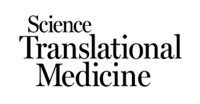
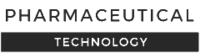

<Banner />

<Container>

Melwy (ex-Startcrowd) is an online lab in artificial intelligence and data science, for precision medicine and drug discovery.

  Research topics include:

  

- Computational biology: prediction of cancer immunotherapy outcomes ([checkpoint inhibitors](https://melwy.com/blog/how-to-better-predict-cancer-immunotherapy-results) and [CAR-T cells](https://melwy.com/blog/car-t-cells-for-solid-cancers-reducing-risks-by-feeding-back-clinical-data)), with machine learning.  

  

- Computational chemistry: predictive and generative models for drug discovery, [with](https://medium.com/the-ai-lab/diversitynet-a-collaborative-benchmark-for-generative-ai-models-in-chemistry-f1b9cc669cba) or [without deep learning](https://medium.com/the-ai-lab/you-didnt-need-deep-learning-to-generate-new-molecules-4c784747b2cc), and [without hype](https://medium.com/the-ai-lab/artificial-intelligence-in-drug-discovery-is-overhyped-examples-from-astrazeneca-harvard-315d69a7f863).

  

Learn more in the [blog](https://melwy.com/blog), [papers](https://scholar.google.fr/scholar?as_q=&as_epq=&as_oq=&as_eq=&as_occt=any&as_sauthors=mostapha%20benhenda&as_publication=&as_ylo=2017&as_yhi=&hl=en&as_sdt=0,5), and [videos](https://youtu.be/AGSbV_XUUvY?list=PLQQ7q6Ebc9A7Izcn1_Myi4nfyGxYzbWPk).

  

Connect with hundreds of experts and enthusiasts, on [Slack](https://join.slack.com/t/dsformedicine/shared_invite/enQtODA1MDc1NDQ4ODIyLTMzNWFiY2YwYmQ4NDBkYTE5ZWQ0NDQ4YmNiMGE5MmMyYWU5MTkyNjgzMDFiNjdjNjRhYWUwNDJjZThjZmQzZDM) and [Telegram](https://t.me/joinchat/Go4mTxRr9Tbx53S_w-0-vQ) communities.

For direct collaboration, [write an email](mailto:info@melwy.com), or fill the form:

  <a class="gtm-button" href="https://mostaphabenhenda.typeform.com/to/fPEidr" rel="external">
    Collaborate
  </a>

## Media Coverage

  

  
 

## Contact

<!--
  The `id="contact"` attribute below is for creating internal anchor link.
  You can remove/change it, but make sure you edit the corresponding link
  in src/gatsby-theme-musician/config/navigation.yml
  See: https://learn.freecodecamp.org/responsive-web-design/basic-html-and-html5/link-to-internal-sections-of-a-page-with-anchor-elements/
-->

info@melwy.com

**Telephone:** +33651206805

</Container>
